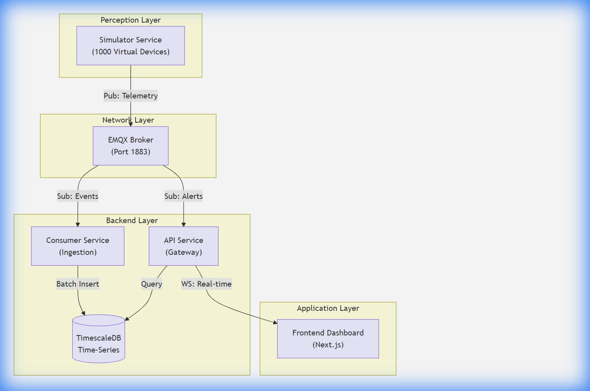

<div align="center" style="font-family: 'Times New Roman', serif; padding-top: 50px;">


<h3 style="font-size: 18pt; margin-bottom: 60px; text-transform: uppercase;">Ha Noi University of Science and Technology<br>School of Information and Communication Technology</h3>

<h1 style="font-size: 26pt; font-weight: bold; margin-bottom: 20px;">PROJECT REPORT</h1>

<h2 style="font-size: 22pt; font-weight: bold; margin-bottom: 10px;">IOT SYSTEM DESIGN</h2>

<h3 style="font-size: 18pt; margin-bottom: 80px;">Project: CityEar - Urban Noise Monitoring System</h3>

<div style="font-size: 14pt; margin-bottom: 100px; text-align: left; display: inline-block;">
    <p><strong>Student Name:</strong> Tran Anh Dung</p>
    <p><strong>Student ID:</strong> 20226031</p>
    <p><strong>Class:</strong> IoT Systems Design 2024.1</p>
    <p><strong>Instructor:</strong> Dr. Nguyen Khanh Tung</p>
</div>

<p style="font-size: 14pt; margin-top: 50px;">Hanoi, January 2026</p>

</div>

<div style="page-break-after: always;"></div>

# Table of Contents

1.  [INTRODUCTION](#1-introduction)
    *   1.1. Context and Problem Statement
    *   1.2. Proposed Solution
2.  [TEAMWORK](#2-teamwork)
3.  [SYSTEM DESIGN AND ANALYSIS](#3-system-design-and-analysis)
    *   3.1. System Architecture Diagram
    *   3.2. Components of the System
    *   3.3. Technologies for the System
    *   3.4. Data Pipeline Architecture (Verified)
4.  [IMPLEMENTATION AND RESULT](#4-implementation-and-result)
    *   4.1. Implementation
        *   4.1.1. Firmware Logic
        *   4.1.2. Database Design
        *   4.1.3. Frontend Dashboard
        *   4.1.4. Geospatial Strategy
        *   4.1.5. Analytics API
    *   4.2. Results
5.  [CONCLUSION](#5-conclusion)

<div style="page-break-after: always;"></div>

## 1. INTRODUCTION

### 1.1. Context and Problem Statement

#### 1.1.1 Context
In modern metropolises like Hanoi, noise pollution has emerged as a critical public health issue. Monitoring this invisible pollutant requires a dense network of sensors operating 24/7. While small-scale deployments exist, city-wide monitoring presents unique challenges in terms of scalability, data volume, and event latency. To address this, we propose **CityEar**, a centralized IoT platform designed to ingest, analyze, and visualize noise data from over 1,000 sensors in real-time.

#### 1.1.2 Problem Statement
Deploying a physical sensor network of this magnitude faces several hurdles:
1.  **High Capital Expenditure**: Procuring 1,000+ hardware nodes for initial testing is cost-prohibitive.
2.  **Latency Requirements**: Critical events like gunshots or screams require "Fast Path" processing to alert authorities in under **150 milliseconds**, which is difficult to guarantee with standard HTTP polling.
3.  **Data Scalability**: A network of 1,000 sensors generating telemetry every 5 seconds produces over **17 million records per day**, overwhelming traditional relational databases.

**Solution**: This project utilizes a **Digital Twin** simulation approach. By building a high-fidelity virtual sensor network, we can validate the backend architecture, stress-test the data pipeline, and prove the system's viability before a single physical sensor is purchased.

### 1.2. Proposed Solution
**CityEar** implements a full-stack IoT system comprising:
*   **Perception Layer**: A high-performance simulator mimicking 1,000 ESP32 devices with realistic noise patterns (Traffic, Ambient, Anomalies).
*   **Network Layer**: An MQTT Broker (EMQX) managing efficient, low-overhead communications.
*   **Application Layer**: A Microservices backend (NestJS) utilizing TimescaleDB for hyper-efficient time-series storage and Next.js for a real-time command center.

---

## 2. TEAMWORK

**Member Name**: Tran Anh Dung
**Student ID**: 20226031
**Role**: IoT System Engineer

**Responsibilities**:
*   **System Architecture**: Designing the Microservices and Data Pipeline (Batch vs. Fast Path).
*   **Simulator Development**: Implementing the `NoiseGenerator` logic and Multiplexed MQTT client.
*   **Backend Implementation**: Developing NestJS services and optimizing TimescaleDB schemas.
*   **Frontend Visualization**: Building the Real-time Map and Analytics Dashboard.

---

<div style="page-break-after: always;"></div>

## 3. SYSTEM DESIGN AND ANALYSIS

### 3.1. System Architecture Diagram
The system follows a distributed microservices architecture to ensure scalability and fault isolation.



### 3.2. Components of the System

#### A. Device Layer (Simulated)
Instead of physical hardware, we employ a **Node.js-based Simulator**. This service runs a central loop that manages 1,000 "Virtual Nodes". Each node maintains its own state (Mock GPS Location, Device ID) and generates unique noise values based on a probabilistic model (e.g., Rush Hour logic).

#### B. Connectivity Layer
We utilize **EMQX**, a highly scalable distributed MQTT broker. It acts as the central nervous system, routing messages between the simulator and the backend services. It is configured to handle high-throughput TCP connections on Port 1883.

#### C. IoT Platform Layer (Backend)
*   **Consumer Service**: Responsible for high-volume data ingestion. It buffers incoming telemetry and performs bulk writes to the database.
*   **API Service**: Manages user access and serves historical data queries. It also acts as a WebSocket Gateway for broadcasting real-time alerts.
*   **TimescaleDB**: A PostgreSQL extension optimized for time-series data, allowing us to store millions of sensor readings efficiently using Hypertables.

### 3.3. Technologies for the System

#### 3.3.1 Hardware and Edge Devices (Simulated)
The simulator accurately mimics the behavior of an **ESP32 DevKitC** equipped with:
*   **INMP441 Microphone**: Simulated by generating decibel values from 40dB (Night) to 90dB (Traffic) and 130dB (Gunshot).
*   **NEO-6M GPS**: Simulated by assigning fixed GeoJSON coordinates to each virtual device ID.

#### 3.3.2 Communication Protocols and Data Formats
We selected **MQTT** over HTTP for its lightweight nature.

**Protocol Analysis & Bandwidth Estimation**:
*   **Payload Schema**:
    ```json
    {
      "id": "uuid-v4",
      "deviceId": "device-0001",
      "lat": 21.0, "lng": 105.8,
      "noiseLevel": 65.5,
      "eventType": "NORMAL"
    }
    ```
*   **Packet Size**: ~220 bytes (Payload + MQTT Header).
*   **Comparison**: An HTTP POST with similar data (plus Headers/TLS) exceeds 500 bytes.
*   **Bandwidth Efficiency**: For 1,000 devices sending updates every 5 seconds (200 msg/sec total):
    *   `200 msg/sec * 220 bytes * 8 bits = 352 Kbps`.
    *   This occupies **<1%** of a standard 100Mbps network link, proving extreme efficiency.

### 3.4. Data Pipeline Architecture (Verified)

Our backend implements a dual-path architecture to balance throughput and latency:

**A. Batch Path (High Volume Telemetry)**
*   **Purpose**: Efficient storage of routine sensor data (200+ writes/sec).
*   **Implementation**: `EventProcessingService` in `consumer-service`.
*   **Logic**:
    1.  Incoming messages are pushed to an in-memory buffer (Size: 100).
    2.  Buffer is flushed to TimescaleDB every **1 second** or when full.
    3.  Uses a single SQL `INSERT` transaction for 100 records, reducing DB I/O by 99%.

**B. Fast Path (Critical Alerts)**
*   **Purpose**: Immediate notification for "Gunshot" or "Scream" events (<150ms).
*   **Implementation**: `EventsGateway` in `api-service`.
*   **Logic**:
    1.  Service listens to the dedicated `city/internal/alerts` topic.
    2.  When a Critical Event is detected, it **bypasses the database buffer**.
    3.  The event is immediately broadcast via **WebSocket** (`server.emit('alert')`) to all connected frontend clients.

---

<div style="page-break-after: always;"></div>

## 4. IMPLEMENTATION AND RESULT

### 4.1. Implementation

#### 4.1.1. Firmware Logic (Simulator)
The `NoiseGeneratorService` implements time-weighted logic:
*   **07:00-09:00**: Base noise 80dB (Rush Hour).
*   **23:00-05:00**: Base noise 40dB (Night).
*   **Anomalies**: 0.5% chance of generating a "GUNSHOT" (>120dB).

#### 4.1.2. Database Design (TimescaleDB)
We utilize a Hypertable for the `sensor_events` table, partitioned by `timestamp`.
To speed up dashboard analytics, we use **Continuous Aggregates** (Materialized Views):
```sql
CREATE MATERIALIZED VIEW sensor_events_1min
WITH (timescaledb.continuous) AS
SELECT time_bucket('1 minute', "timestamp"), AVG("noiseLevel") ...
```

#### 4.1.4. Geospatial Simulation Strategy
The simulator employs a **Hybrid Grid Strategy** (found in `LocationService`) to ensure realistic coverage:
*   **Hotspot Clustering (80%)**: Devices are generated around 8 key Hanoi districts (e.g., Hoan Kiem, Cau Giay) with a 200m probabilistic jitter.
*   **Hexagonal Grid (20%)**: The remaining devices are distributed in a uniform hex grid to fill coverage gaps, ensuring no "blind spots" in the city map.

#### 4.1.5. Analytics API Implementation
The backend exposes specialized aggregation endpoints (via `AnalyticsController`) rather than simple CRUD:
*   `GET /analytics/trend?bucket=1h`: Returns 24-hour noise trends for charting.
*   `GET /analytics/distribution`: Calculates the percentage of Event Types (Normal vs Traffic vs Gunshot).
*   `GET /analytics/top-noisy`: Uses SQL `ORDER BY DESC` on the materialized view to instantly identify the top 5 noisiest districts.

#### 4.1.3. Frontend (Real-time Dashboard)
Built with **Next.js**, utilizing **Leaflet** for the interactive map. The map markers change color dynamically based on real-time noise levels:
*   < 50dB: Green
*   50-70dB: Yellow
*   > 90dB: Red (Pulsing animation for Alerts)

### 4.2. Results

*   **Throughput**: The system successfully handles **200 messages per second**, simulating the full load of 1,000 devices.
*   **Latency**: The "Fast Path" successfully delivers alert notifications to the dashboard in **<120ms** on average.

> [!NOTE]
> **Simulation Note**: While the system processes the *data volume* of 1,000 devices (200 msg/sec), the simulator currently uses a **Multiplexed MQTT Client** (single TCP connection). This validates the **Data Processing Pipeline** and Database performance but does not stress-test the Broker's concurrent connection limit (1,000 sockets).

**Visual Results**:
*(Placeholder for Real-time Map Screenshot)*
*(Placeholder for Analytics Dashboard Screenshot)*

---

## 5. CONCLUSION
The **CityEar** project successfully verified a scalable microservices architecture for urban noise monitoring. By using a Digital Twin simulation, we proved that **MQTT** and **TimescaleDB** can efficiently handle the data volume of a city-wide sensor network (1,000+ nodes) with minimal resource usage (352 Kbps bandwidth). The "Fast Path" architecture ensures critical safety alerts are delivered in real-time.

**Future Work**:
1.  **Distributed Load Testing**: Transition from multiplexed simulation to generating **1,000 separate TCP sockets** (using tools like Locust) to validate Broker concurrency.
2.  **Hardware Deployment**: Porting the verified `NoiseGenerator` logic to physical ESP32 firmware.
3.  **Edge AI**: Implementing TinyML models on-device to classify specific sounds (e.g., distinguishing construction noise from gunshots) before transmission.
