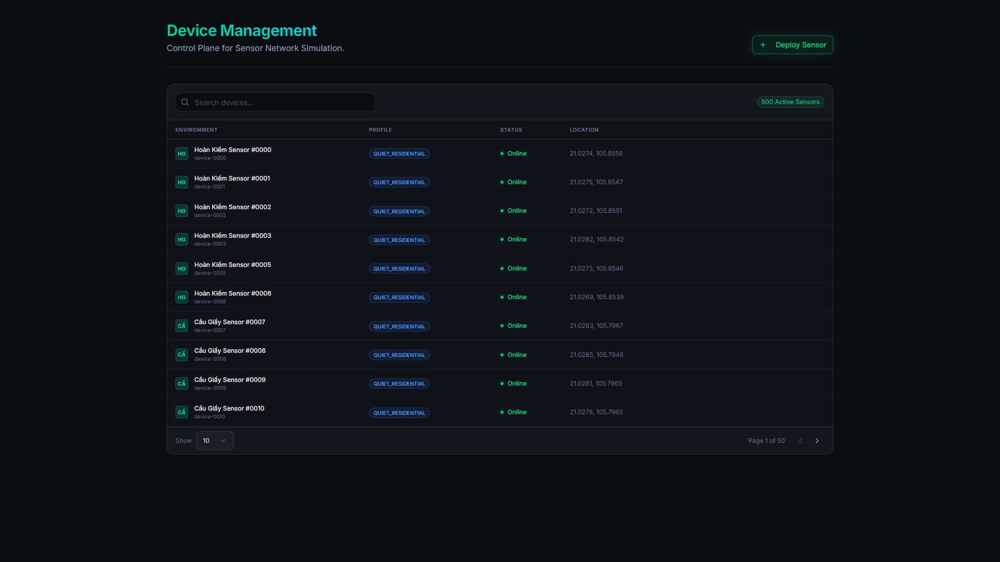
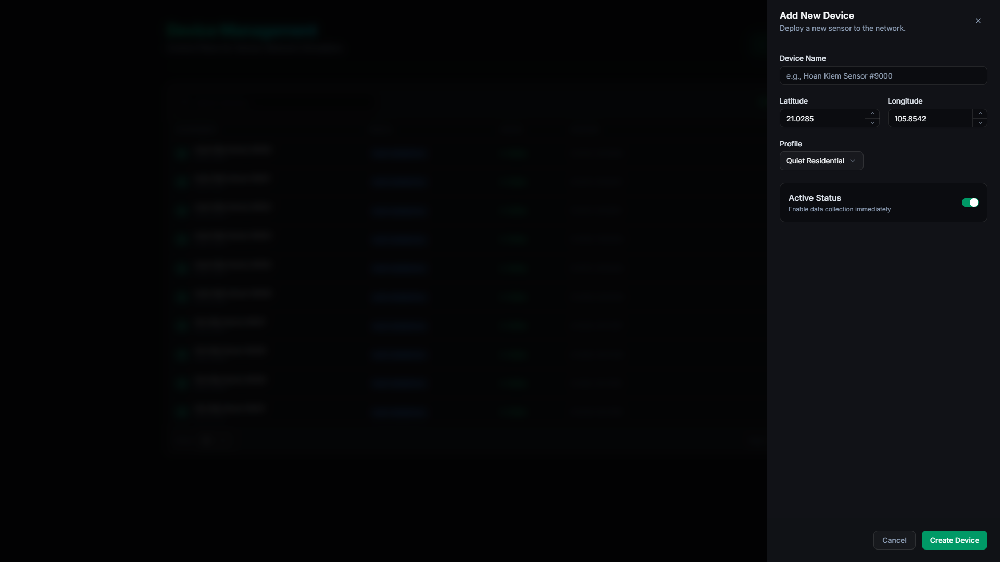
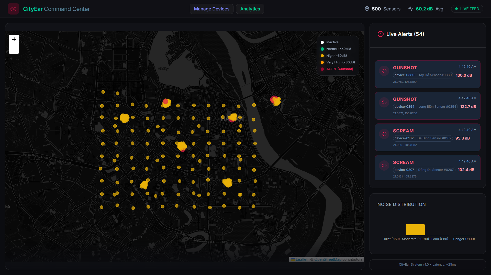
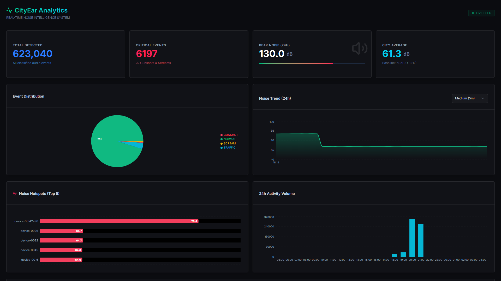

# CityEar - IoT Presentation Outline

## Slide 1: Title Slide
*   **Project**: CityEar - Urban Noise Monitoring System
*   **Student**: Tran Anh Dung (20226031)
*   **Role**: IoT System Engineer

---

## Slide 2: The Problem
*   **Urban Noise Pollution** impacts public health in Hanoi
*   Traditional monitoring: Expensive, sparse, static stations
*   **Challenge**: Need 1000+ sensors for 24/7 city-wide coverage
*   **Our Approach**: Digital Twin Simulation to validate architecture before deployment

---

## Slide 3: Network Architecture - Star Topology
*   **Perception Layer**: 1000 Simulated IoT Nodes (Node.js/NestJS)
*   **Network Layer**: MQTT Broker (EMQX)
*   **Application Layer**: Stream Processing + Dashboard
*   **Key Advantage**: Deterministic latency for critical alerts

---

## Slide 4: Software Architecture - Microservices

**Four Core Services**:
1. **Simulator Service**: Device lifecycle + Noise generation
2. **Consumer Service**: MQTT ingestion + Batch processing
3. **API Service**: REST endpoints + WebSocket gateway
4. **Frontend**: Real-time map + Analytics dashboard

---

## Slide 5: Why MQTT? (Protocol Analysis)
*   **Lightweight**: 2-byte headers vs HTTP overhead
*   **Pub/Sub Model**: Asynchronous, decoupled communication
*   **QoS Levels**:
    *   **QoS 0**: Telemetry (At most once)
    *   **QoS 1**: Critical alerts (At least once - guaranteed delivery)

---

## Slide 6: The Simulator - Digital Twin Logic

**Time-Based Noise Patterns**:
*   Rush Hours (07:00-09:00, 17:00-19:00): **80dB** (Traffic)
*   Night Hours (23:00-05:00): **40dB** (Quiet)
*   Normal Hours: **60dB** (Baseline)

**Anomaly Injection**:
*   Gunshots (0.5%): **120-130dB**
*   Screams (0.5%): **95-105dB**

---

## Slide 7: Data Pipeline - Fast Path vs Batch Path

**Batch Path** (Normal Events):
*   Buffered for 1 second → Bulk write to TimescaleDB

**Fast Path** (Critical Alerts):
*   Immediate republish to `city/internal/alerts`
*   WebSocket broadcast to frontend
*   **< 150ms** end-to-end latency

**Data Flow**: Simulator → MQTT → Consumer → DB → API → WebSocket → Frontend (< 150ms)

---

## Slide 8: Visualization & Analytics

**Real-time Map**:
*   Color-coded markers (Green → Yellow → Orange → Red)
*   Pulsing animation for critical alerts

**Analytics Dashboard**:
*   Event distribution (Pie chart)
*   Noise trends (Time-series)
*   Top 5 hotspots (Bar chart)

---

## Slide 9: Technical Results

**Performance Metrics**:
*   **Simulated Load**: 1000 concurrent devices
*   **Throughput**: 200+ messages/second
*   **Latency**: < 150ms for critical alerts
*   **Scalability**: TimescaleDB handles millions of rows/day

**Database**: PostgreSQL + TimescaleDB (hypertables) + PostGIS (geospatial)

---

## Slide 10: Live Demonstration

**Video Demo**: [demonstration.mp4](videos/demonstration.mp4)

**Key Moments**:
1. Real-time map with live device updates
2. Device creation and management
3. Analytics dashboard with interactive filtering
4. Critical alert detection (Gunshot → < 150ms notification)

*Alternative: Live demo if presentation environment allows*

---

## Slide 11: Future Work

1. **Hardware Deployment**: Transition from simulation to physical ESP32 devices
2. **Edge AI**: Implement TinyML for on-device sound classification
3. **Low-Power WAN**: Investigate LoRaWAN for wider coverage

---

## Slide 12: Q&A

Thank you for your attention.

**GitHub**: [github.com/Ries0703/project-iot-20251](https://github.com/Ries0703/project-iot-20251)
